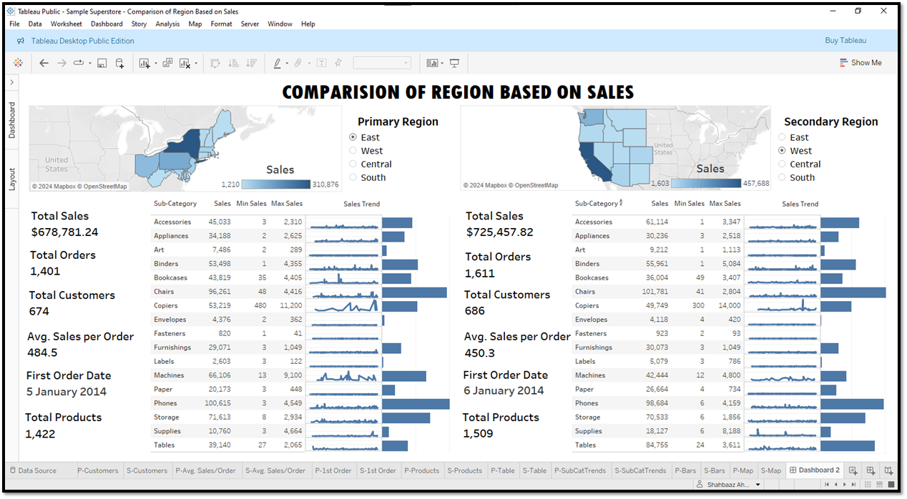

# 📊 Tableau Project: Comparison of Region Based on Sales

## 📌 Project Overview
This project analyzes and compares **sales performance** between two selected regions using the **Sample Superstore dataset** in Tableau.  
The dashboard provides interactive parameters for **Primary Region** and **Secondary Region**, allowing users to compare sales side by side with tables, line graphs, bar charts, and maps.

---

## 🛠️ Tools & Technologies
- **Tableau Public** (for visualization and dashboard creation)
- **Microsoft Excel** (Sample Superstore dataset)
- **GitHub** (for project documentation and portfolio)

---

## 📂 Repository Structure
📂 Tableau-Comparison-of-Region-Sales
┣ 📂 datasets
┃ ┗ Sample_Superstore.xls
┣ 📂 images
┃ ┗ Dashboard_Image.png
┣ SampleSuperstore-ComparisonofRegionBasedonSales.twbx
┣ Screenshots Tableau Project.pdf
┣ My Learning Experience.pdf
┗ README.md

- **datasets/** → Contains the Excel dataset used for analysis.  
- **images/** → Contains the final dashboard screenshot.  
- **SampleSuperstore-ComparisonofRegionBasedonSales.twbx** → Tableau Packaged Workbook (project file).  
- **Screenshots Tableau Project.pdf** → Step-by-step screenshots of the dashboard creation.  
- **My Learning Experience.pdf** → Summary of key learnings from the project.  

---

## 📊 Features of the Dashboard
- Interactive comparison between **Primary** and **Secondary** regions.  
- Sales metrics table with:
  - **Sub-Category**
  - **Total Sales**
  - **Minimum Sales**
  - **Maximum Sales**
  - **Trend Line Graphs**
  - **Horizontal Bar Charts**
- Regional sales distribution displayed on maps.  
- Dynamic parameter-based filtering for user interactivity.  

---

## 🚀 How to Use
1. Clone or download this repository.  
2. Open the Tableau workbook:  
3. Explore the dashboard:
- Select **Primary Region** from the parameter dropdown.  
- Select **Secondary Region** from the parameter dropdown.  
- View side-by-side comparison of sales metrics and trends.  

---

## 📝 Learning Experience
This project enhanced my Tableau skills by teaching me how to:  
- Use **parameters and calculated fields** for dynamic filtering.  
- Build **hierarchies** for geographic drill-down.  
- Align multiple visualizations (tables, line graphs, bar charts, and maps) in a professional dashboard layout.  
- Organize data into **folders** for efficiency.  

Working through challenges like aligning sub-categories across tables and graphs gave me strong problem-solving experience, and I am now more confident in building **professional-grade dashboards** for real-world analysis.

---

## 📸 Sample Dashboard
Here’s the final output snapshot of the Tableau Dashboard:

---

## 📑 References
- Dataset: *Sample Superstore* (provided by Tableau)  
- Documentation: *Screenshots Tableau Project.pdf*  

